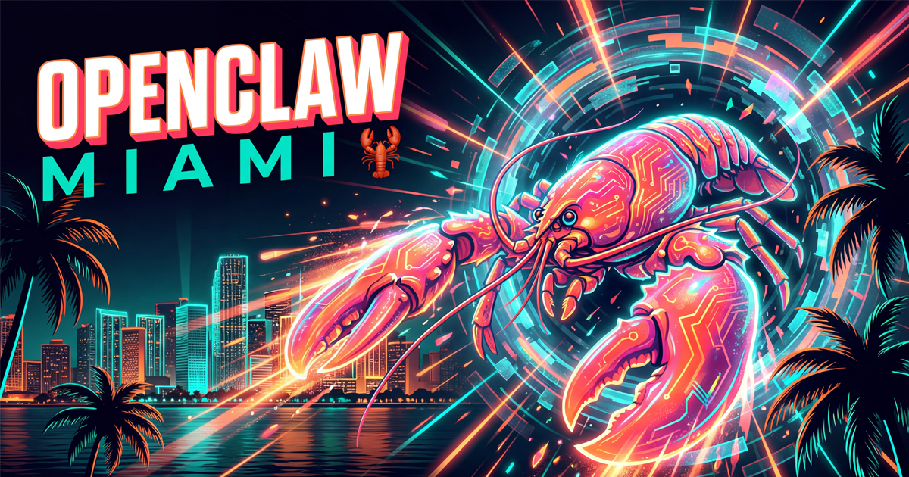

<div align="center">



# OpenClaw Miami

**Miami's community for the AI agent that's breaking the internet.**

[](https://opensource.org/licenses/MIT)
[](https://discord.com/channels/1456350064065904867/1464825842264703221)
[](https://github.com/openclaw/openclaw)
[](https://lu.ma/openclaw)
[](https://vitejs.dev/)

[Website](https://openclawmiami.com) · [Events](https://lu.ma/openclaw) · [Discord](https://discord.com/channels/1456350064065904867/1464825842264703221) · [Contribute](#contributing)

</div>

---

## What is OpenClaw Miami?

We're **50+ builders** in Miami exploring the future of personal AI. [OpenClaw](https://github.com/openclaw/openclaw) is the open-source AI agent with **145K+ GitHub stars** — and we're bringing it to life locally.

- **Monthly meetups** — Hands-on sessions, demos, and networking
- **Setup help** — Get OpenClaw running on your machine
- **Community** — Connect with Miami's AI builders

## Quick Start

```bash
git clone https://github.com/Purple-Horizons/openclawmiami.git
cd openclawmiami
npm install
npm run dev
```

Open [http://localhost:8080](http://localhost:8080) and you're in.

## Commands

| Command | Description |
|---------|-------------|
| `npm run dev` | Dev server with HMR |
| `npm run build` | Production build |
| `npm run preview` | Preview production build |
| `npm run lint` | ESLint |
| `npm run test` | Vitest |

## Tech Stack

**React 18** · **TypeScript** · **Vite** · **Tailwind CSS** · **shadcn/ui** · **Framer Motion**

## Contributing

We love contributions! Here's how:

1. **Fork** the repo
2. **Create** a branch (`git checkout -b feature/cool-thing`)
3. **Make** your changes
4. **Test** (`npm run lint && npm run test`)
5. **Push** and open a **PR**

See something broken? [Open an issue](https://github.com/Purple-Horizons/openclawmiami/issues).

## Contact

| Who | Links |
|-----|-------|
| **Gianni Dalerta** | [@gianni-dalerta](https://github.com/gianni-dalerta) · [@giannidalerta](https://twitter.com/giannidalerta) |
| **Ralph Quintero** | — |
| **Purple Horizons** | [purplehorizons.io](https://purplehorizons.io) |

## License

MIT — do whatever you want.

---

<div align="center">

**Built with 🦞 in Miami**

[Join the community →](https://discord.com/channels/1456350064065904867/1464825842264703221)

</div>
